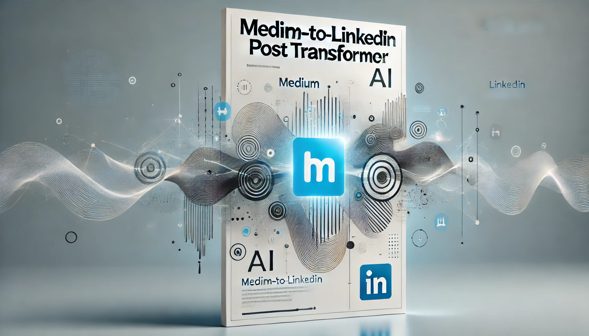

# LinkedIn Post Pipeline Tool

<p align="center">
  <i align="center">Instantly convert your Medium articles into LinkedIn posts 🚀</i>
</p>


<div align="center">

</div>

<br> 

Transform your Medium articles into professional-grade LinkedIn posts effortlessly! This project taps into the potential of LLMs, implementing an innovative judging mechanism based on the [LLM as a judge paper](https://huggingface.co/papers/2306.05685).

- Streamlines content repurposing.
- Built with ChatGPT and designed for extensibility.
- Includes a basic feedback loop for improved output quality.

<br>

🚀  Your feedback is greatly appreciated. 

<br>

## 🔧 How to Setup/ Run

```shell
# Open a terminal (Command Prompt or PowerShell for Windows, Terminal for macOS or Linux)

# Ensure Git is installed
# Visit https://git-scm.com to download and install console Git if not already installed

# Clone the repo
git clone git@github.com:mdixon1010/li-post-pipeline.git

# Create a python virtual envrionment
python3 -m venv lipost

# Activate your virtual environment
source lipost/bin/activate

# Install dependencies with pip
pip install -r requirements.txt

# Create an environment file using the format in `env/.env_sample`
touch env/.env

#Source your env file
source env/.env

#Create LinkedIn post from Medium article
python src/li_post_pipeline.py ARTICLE_TITLE=title USER=user

# Actual Example: 
python src/li_post_pipeline.py "BigQuery Table Partitioning — A Comprehensive Guide" matt.dixon1010

```

<br>

##  📚 Helpful Links
- [Scraping Medium RSS Feed](https://pub.towardsai.net/scraping-your-medium-stories-a3a078ab2e7f)
- [OpenAI API Key Usage Activity Page](https://platform.openai.com/usage/activity)

<br> 

## 🌏 External Services Used
- [ChatGPT API](https://platform.openai.com/)

<br>

## 🤖 Pre-Push to Origin

```shell
# Run Tests
pytest tests/

# Check Test Coverage
pytest --cov=src tests/

# Check Linting
flake8 src/
```

<br>

## 📝  To Do

- [ ] Increase test coverage
- [ ] Clean up linting results


<br>
<br>


<div align="center">
    
</div>

<h4 align="center">
  <a href="https://www.beardeddata.com/"> BeardedData.com </a>
